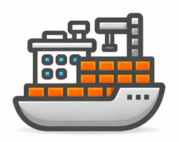

# Hawser Agent – Home Assistant

Agent Docker permettant de connecter Home Assistant à Dockhand.

## Fonctionnement
- Connexion sortante (Edge mode)
- Accès Docker requis

## Sécurité
⚠️ Accès Docker = contrôle total de l’hôte
